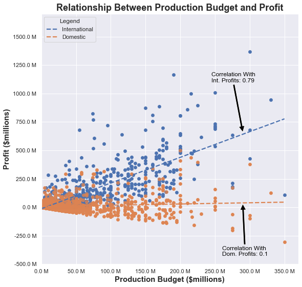

## Overview

Microsoft is standing up a new movie studio to compete with other major technology and media companies, but lacks data on what goes into making a successful movie. We were tasked with performing exploratory data analysis on the movie industry and providing recommendations based on our findings.

## Business Problem

Microsoft sees all the big companies creating original video content and they want to get in on the fun. They have decided to create a new movie studio, but they don’t know anything about creating movies. You are charged with exploring what types of films are currently doing the best at the box office. You must then translate those findings into actionable insights that the head of Microsoft's new movie studio can use to help decide what type of films to create.

## Data Sources and Methods

Financial data used in this notebook is drawn from The Numbers (http://www.the-numbers.com/). Basic movie information is drawn from the Internet Movie Database (IMDB, http://www.imdb.com/). We begin by cleaning our data to create a dataset that includes movies from 2012 to 2019 - beginning with the year Netflix released its first original, and ending with the final full year before the COVID-19 pandemic disrupted the movie industry. We used descriptive analysis, including tables, visualizations, and rankings to dig into the relationships between production budget, profit, and genre.

## Results

Based on our analysis, we generated four recommendations for Microsoft:
1. Microsoft should be sure to market its films internationally to maximize the value of its production dollar.

2. Microsoft should focus on making movies that include a mix of characteristics from the Sci-Fi, Animation, and/or Thriller genres in particular.

3. To minimize the risk of significant financial loss from any one movie, Microsoft should avoid making action movies with high budgets.

4. Microsoft should avoid hiring David Gordon Green, Simon West, Kevin Smith, Justin Chadwick, James Gray, Mira Nair, Jacques Audiard, and David Koepp to direct movies for its studio.

## Links to Materials

